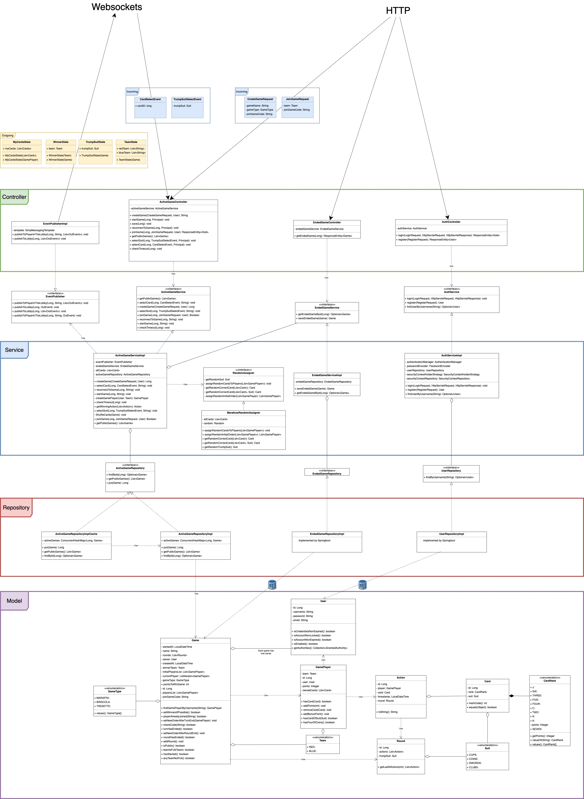

# Marafone Backend

**Team:** Tomasz Jarząbek, Norbert Koziana, Szymon Gryz  

## Directory Structure  

### Authorization (`auth`)  
Contains classes responsible for user authentication mechanisms.  

### Logged-in User (`user`)  
Classes handling the currently logged-in user, including endpoints to check the active user.  

### Game Logic (`game`)  
The core module of the application.  

#### Subdirectories:  
- **`active`:** Handles active games.  
  - Endpoints for processing game-related requests.  
  - Games are stored in memory (HashMap).  
- **`broadcaster`:** Manages event broadcasting (backend → frontend) using WebSockets.  
- **`config`:** WebSocket configuration.  
- **`ended`:** Logic for saving game results in the database and handling game history.  
- **`event`:** Handles messaging:  
  - **`incoming`:** Messages from the frontend.  
  - **`outgoing`:** Messages sent from the backend to the frontend.  
  - All events are broadcast on a single WebSocket topic: `/topic/game/{id}`.  
  - Event types are distinguished using the `class` field, which contains the event class name (leveraging inheritance from `OutEvent` and the `@JsonTypeInfo` annotation).  
- **`model`:** Classes representing game data, e.g., selected cards during gameplay.  
  - Data is stored in memory during the game and saved to the database after the game ends.  

---

## Design Patterns  

### Layered Architecture  
The application follows a layered architecture, divided into:  
- **Controller:** Handles HTTP and WebSocket requests (e.g., `UserController`, `EndedGameController`, `ActiveGameController`).  
- **Service:** Manages business logic (e.g., `EndedGameService`, `ActiveGameService`, `UserService`).  
- **Repository:** Handles data access, with Spring Data automating repository implementation (e.g., `EndedGameRepository`, `ActiveGameRepository`, `UserRepository`).  

### Proxy Pattern  
- **`ActiveGameRepositoryImplCache`** acts as a caching layer for active games.  
- **`ActiveGameRepositoryImpl`** serves as the actual repository implementation.  
- This pattern optimizes data access by caching results through a proxy layer.  

### Observer Pattern  
- **`EventPublisher`** and **`EventPublisherImpl`** implement the observer pattern:  
  - They emit events through WebSockets to notify about game state changes.  
  - The frontend acts as the observer (subscriber) in this pattern.  

### Singleton Pattern  
- Service and Repository components in Spring Boot are singletons by default, managed by the Spring container.  
- This ensures one instance of a class exists within the application context.  

**Benefits:**  
- Simplified usage with no need to manually control instances.  
- Spring manages the lifecycle of components.  

---

## Class Diagram

